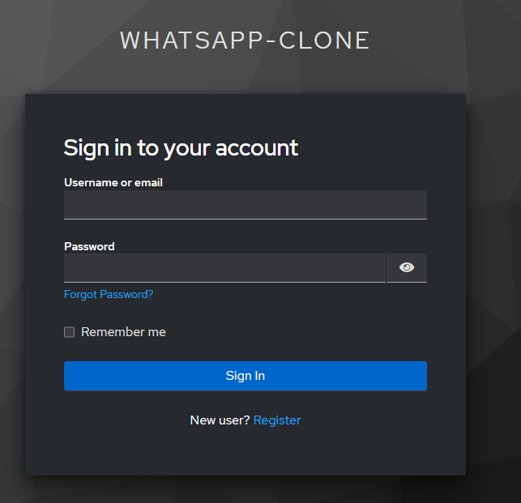
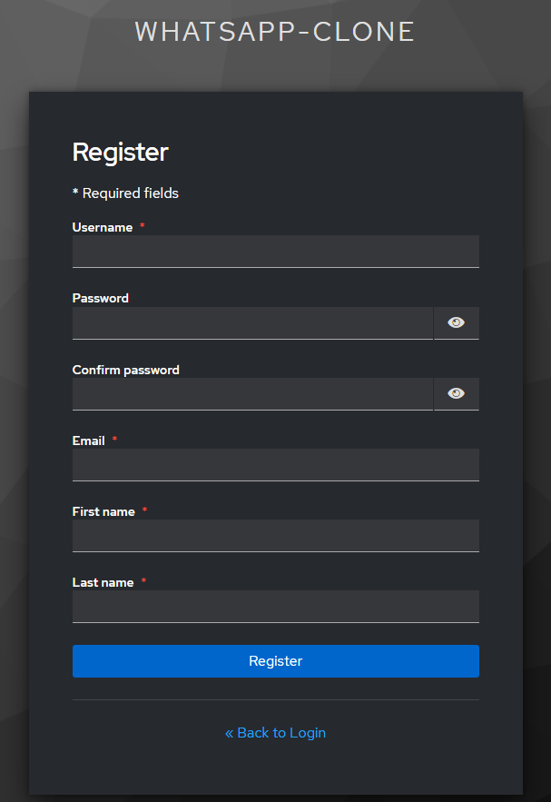
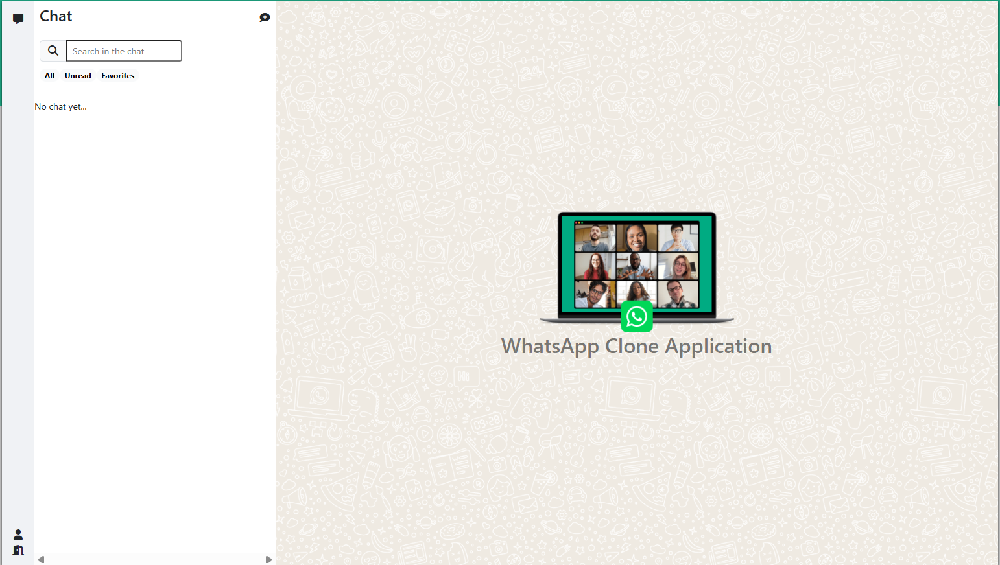
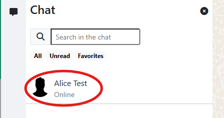
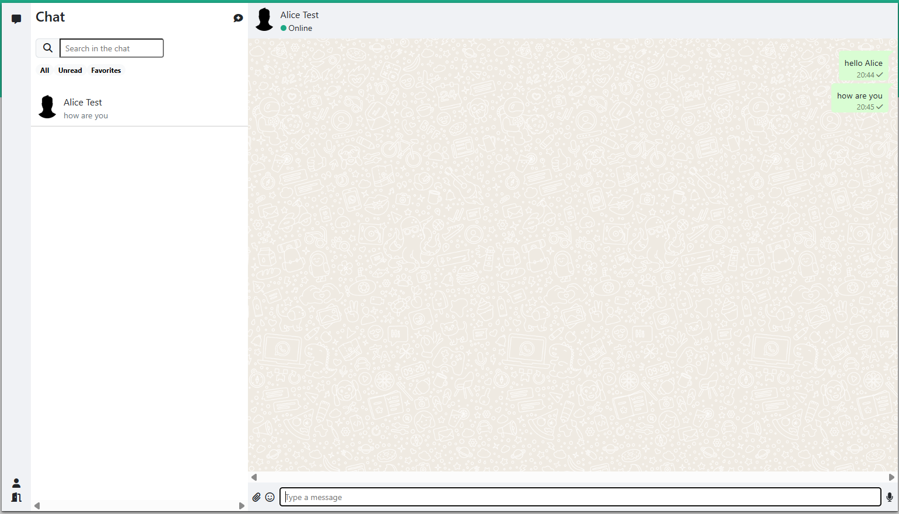
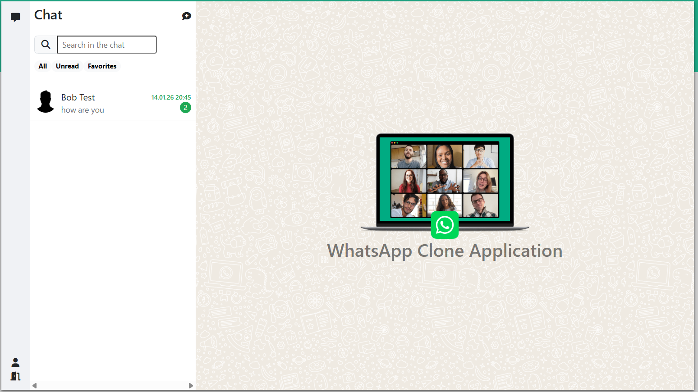
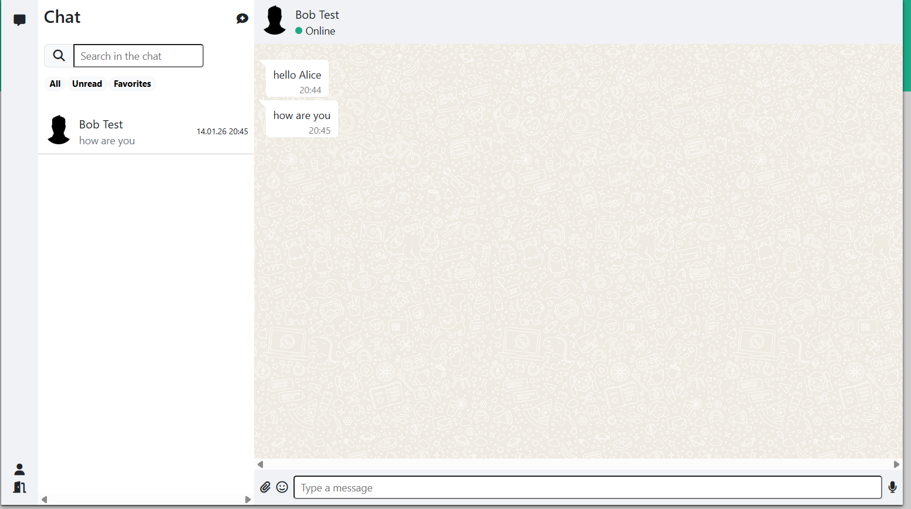
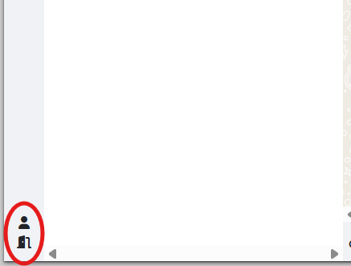

# 💬 WhatsApp Clone – Real-time Chat Application

<div align="center">


</div>

---

## 📌 Overview

**WhatsApp Clone** is a modern real-time chat application designed for **1-to-1 messaging**. It features a **responsive frontend** and a **scalable backend** built with an **event-driven architecture**.

The system uses:

- **Angular 19** for frontend UI
- **Spring Boot 3.x** for backend services
- **WebSocket (STOMP + SockJS)** for real-time communication
- **Keycloak** for authentication & identity management
- **Kafka** for asynchronous message processing
- **PostgreSQL** for data persistence
- **Docker Compose** for local development

This project is ideal for **learning real-time systems**, **backend architecture**, and **portfolio demonstration**.

---

## 🎯 Key Features

### 💬 Real-time Chat

- 1-to-1 private messaging
- WebSocket communication using STOMP protocol
- Real-time message delivery and notifications
- User online/offline status detection
- Message persistence

### 🔐 Authentication & Authorization

- Centralized authentication via **Keycloak**
- OAuth2 / OpenID Connect support
- Secure WebSocket connections with JWT tokens
- Frontend login using `keycloak-js`
- Role-based access control

### 📩 Message Processing

- Messages sent through WebSocket
- Published to **Kafka topics** for asynchronous processing
- Kafka consumers persist messages into PostgreSQL
- Decoupled & scalable chat pipeline
- Event-driven architecture

### 👥 User Management

- User registration and profile management
- Contact list management
- Last seen tracking

---

## 📸 Screenshots

### 🔐 Authentication Flow

<table align="center">
  <tr>
    <td align="center">
      <br/>
      <b>Login with Keycloak</b>
    </td>
    <td align="center">
      <br/>
      <b>User Registration</b>
    </td>
  </tr>
</table>

---

### 💬 Chat Application Flow

<p align="center">
  
  <br/>
  <i>Home page showing conversations and contacts</i>
</p>

<p align="center">
  
  <br/>
  <i>Initiate a new private chat</i>
</p>

<p align="center">
  
  <br/>
  <i>Select a user to start conversation</i>
</p>

<p align="center">
  
  <br/>
  <i>Chat interface with real-time messaging</i>
</p>

<p align="center">
  
  <br/>
  <i>Receiving messages via WebSocket in real time</i>
</p>

<p align="center">
  
  <br/>
  <i>Send emojis and images in conversation</i>
</p>

<p align="center">
  
  <br/>
  <i>View persisted chat history</i>
</p>

<p align="center">
  
  <br/>
  <i>Manage profile and logout</i>
</p>


## 🛠️ Technologies Used

### Backend

- **Framework**: Spring Boot 3.x
- **Language**: Java 21
- **WebSocket**: STOMP over SockJS
- **Message Broker**: Apache Kafka 7.6
- **Security**: Keycloak (OAuth2 / OIDC), JWT
- **Database**: PostgreSQL 16
- **ORM**: Spring Data JPA / Hibernate
- **Build Tool**: Maven

### Frontend

- **Framework**: Angular 19
- **Styling**: Bootstrap 5
- **Authentication**: keycloak-js
- **WebSocket Client**: sockjs-client, stompjs
- **Rich Text Editor**: Quill
- **Emoji Picker**: ngx-emoji-mart
- **API Client**: OpenAPI Generator
- **Testing**: Karma, Jasmine

### DevOps

- **Containerization**: Docker, Docker Compose
- **Message Queue**: Apache Kafka with Zookeeper
- **Identity Provider**: Keycloak

---

## 📁 Project Structure

```
whatsapp-clone/
├── keycloak/                       # Keycloak realm configuration
│   └── realm-whatsapp-clone.json
├── whatsapp-clone-ui/              # Angular frontend
│   ├── src/
│   │   ├── app/
│   │   │   ├── components/        # Reusable components
│   │   │   ├── pages/             # Page components
│   │   │   ├── services/          # HTTP & WebSocket services
│   │   │   ├── models/            # TypeScript interfaces/models
│   │   │   └── app.component.ts
│   │   ├── assets/
│   │   └── styles/
│   ├── package.json
│   └── angular.json
├── whatsappclone/                  # Spring Boot backend
│   ├── .mvn/
│   ├── src/
│   │   ├── main/
│   │   │   ├── java/com/hoangha/whatsappclone/
│   │   │   │   ├── chat/              # Chat domain (conversation, room)
│   │   │   │   ├── message/           # Message domain
│   │   │   │   ├── user/              # User domain
│   │   │   │   ├── notification/      # Notification domain
│   │   │   │   ├── file/              # File upload/download
│   │   │   │   ├── kafka/             # Kafka producers/consumers
│   │   │   │   ├── ws/                # WebSocket (STOMP)
│   │   │   │   ├── security/          # Security & JWT
│   │   │   │   ├── interceptor/       # HTTP/WebSocket interceptors
│   │   │   │   ├── common/            # Shared utilities & base classes
│   │   │   │   └── WhatsAppCloneApiApplication.java
│   │   │   └── resources/
│   │   │       ├── application.yml
│   │   │       ├── application-prod.yml
│   │   │       └── db/
│   │   └── test/                      # Unit & integration tests
│   └── pom.xml
├── docker-compose.yml                # Main orchestration
└── README.md
```

---

## 🚀 Getting Started

### 1️⃣ Clone Repository

```bash
git clone https://github.com/CanHoangHa/whatsapp-clone.git
cd whatsapp-clone
```

### 2️⃣ Set Up Required Containers

Use Docker Compose to create the necessary containers for the backend:

```bash
docker-compose up -d
```

This will start the following services:

- **PostgreSQL**: Database for backend
- **Keycloak**: Identity provider for authentication
- **Zookeeper**: Kafka dependency
- **Kafka**: Message broker for asynchronous processing

---

### 3️⃣ Run Backend (Spring Boot)

1. Navigate to the backend directory:

```bash
cd whatsappclone
```

2. Build the backend:

```bash
./mvnw clean package
```

3. Run the backend:

```bash
java -jar target/whatsappclone-0.0.1-SNAPSHOT.jar
```

The backend will be accessible at:

- **Backend**: http://localhost:8080

---

### 4️⃣ Run Frontend (Angular)

1. Navigate to the frontend directory:

```bash
cd whatsapp-clone-ui
```

2. Install dependencies:

```bash
npm install
```

3. Start the development server:

```bash
ng serve
```

The frontend will be accessible at:

- **Frontend**: http://localhost:4200

---

### 5️⃣ Access Services

- **Frontend**: http://localhost:4200
- **Backend**: http://localhost:8080
- **Keycloak**: http://localhost:9090
- **Swagger**: http://localhost:8080/swagger-ui/index.html

---

## 📋 System Requirements

- **Java**: JDK 21 or higher
- **Node.js**: 18.x or higher
- **Maven**: 3.8+ (or use Maven Wrapper)
- **Docker**: 20.10+ and Docker Compose 2.0+

---

## 📄 License

This project is developed for educational purposes and personal portfolio demonstration.

